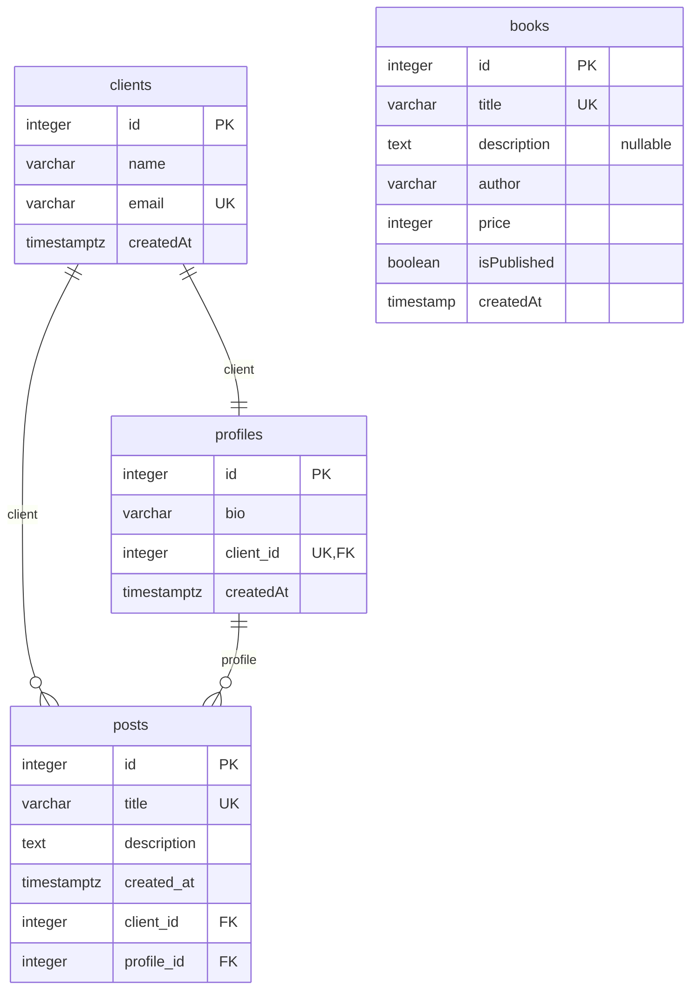

# Database ERD

> Auto-generated from the live Postgres schema. Do not edit by hand.
> Last updated: 2026-08-05T00:27:30.302Z

```mermaid
erDiagram
    clients ||--o{ posts : "client"
    profiles ||--o{ posts : "profile"
    clients ||--|| profiles : "client"

    books {
        integer id PK
        varchar title UK
        text description "nullable"
        varchar author
        integer price
        boolean isPublished
        timestamp createdAt
    }

    clients {
        integer id PK
        varchar name
        varchar email UK
        timestamptz createdAt
    }

    posts {
        integer id PK
        varchar title UK
        text description
        timestamptz created_at
        integer client_id FK
        integer profile_id FK
    }

    profiles {
        integer id PK
        varchar bio
        integer client_id UK,FK
        timestamptz createdAt
    }
```
